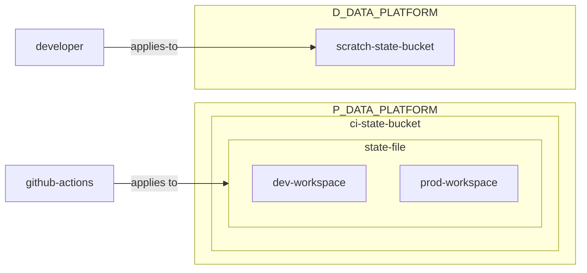

# data-platform-iac
Infrastructure as code for the data platform, supporting resources in our AWS accounts `D_DATA_PLATFORM`,
`D_DATABRICKS`, `P_DATA_PLATFORM` and `P_DATABRICKS`.

## State files
State for all modules will be stored in `P_DATA_PLATFORM`. Any changes to CI-managed modules must go through CI (or CN admin);
most contributors will not have access to `P_DATA_PLATFORM`. Deployments of the same module between different accounts
will be managed by [Terraform workspaces.](https://developer.hashicorp.com/terraform/language/state/workspaces)

For development purposes, you can use a state bucket in the `D_DATA_PLATFORM`; just note that those
resources will not be managed by CI and should be cleaned up after use.



### Working with workspaces
Workspace options are `dev` and `prod`.
```shell
# Initialize the terraform directory
terraform init

# Select the correct workspace
terraform workspace select dev

# Generate an execution plan to review resources to be created
terraform plan

```

# Databricks
Governs catalogs, schemas, and permissions for all Databricks environments.


# Contributing
## Pre-commit hooks
https://github.com/antonbabenko/pre-commit-terraform#how-to-install

```shell
brew install pre-commit terraform-docs tflint tfsec checkov terrascan infracost tfupdate minamijoyo/hcledit/hcledit jq
pre-commit install
```
