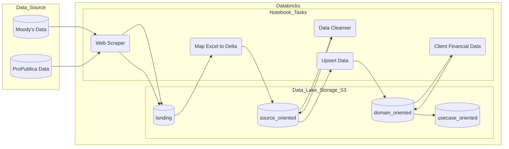

# etl-organization-financial-data

ETL pipeline for adding healthcare organization financial data to the data lake and supporting refreshing the data via Databricks jobs. Private/for-profit systems are provided by a Moody's Municipal Financial Ratio Analysis (MFRA) data subcription, and public and non-profit systems financials are provided by ProPublica.



**Associated Artifacts**
* [Notion - Organization Financial Data](https://www.notion.so/cliniciannexus/Organization-Financial-Data-1612458634194020bfbb43fe040c0fcc#0c40ebbd16ad47448b8edbeebb2fa7d5)
* data.world (TBD)
* Databricks ETL Job - dev | qa | [nonprod](https://cn-us-east-1-nonprod-ws01.cloud.databricks.com/?o=8220587085006308#job/155257189260741) | prod

## Source

* [Moody's MFRA data](https://www.moodysanalytics.com/product-list/mfra-municipal-financial-ratio-analysis) 
* ProPublica 

## Intermediate
* `source_oriented.default.moodys_financial`
* `source_oriented.default.moodys_mfra`
* `source_oriented.default.moodys_od`
* `source_oriented.default.moodys_propublica_org_financial_mapping`
* `source_oriented.default.moodys_ratio`
* `source_oriented.default.propublica_financials`

## Target 
* Organization Financials Data (`domain_oriented.default.organization_financials`)

## Sphinx Setup
1. Make sure requirements.txt are installed
2. Create a **'docs'** folder in the same root folder as the python module
3. Run **'sphinx-quickstart'** in the **'docs'** folder, use default settings
4. Navigate to root folder of the module and **'docs'** folder and run **'sphinx-apidoc -o docs .'**
5. In **'docs/conf.py'**:
 * Paste **'sphinx.ext.todo', 'sphinx.ext.viewcode', 'sphinx.ext.autodoc'** into the extensions list
 * Change theme to **'sphinx_rtd_theme'**
 * Paste 
 	~~~~
  	import os
    import sys
    sys.path.insert(0, os.path.abspath('..'))
	~~~~
	anywhere in the file
6. In **modules.rst** and **index.rst** fill out the toctree with the names of the modules you would like to be added
7. In the **'docs'** folder, **'make html'** will generate the html documentation in the **_build** folder
8. (Optional) For easier formatting of documentation, VSCode extension **'autoDocstring'** can be configured for Sphinx to auto format docstrings


```commandline
docker run -p 4444:4444 selenium/standalone-chrome:112.0
```